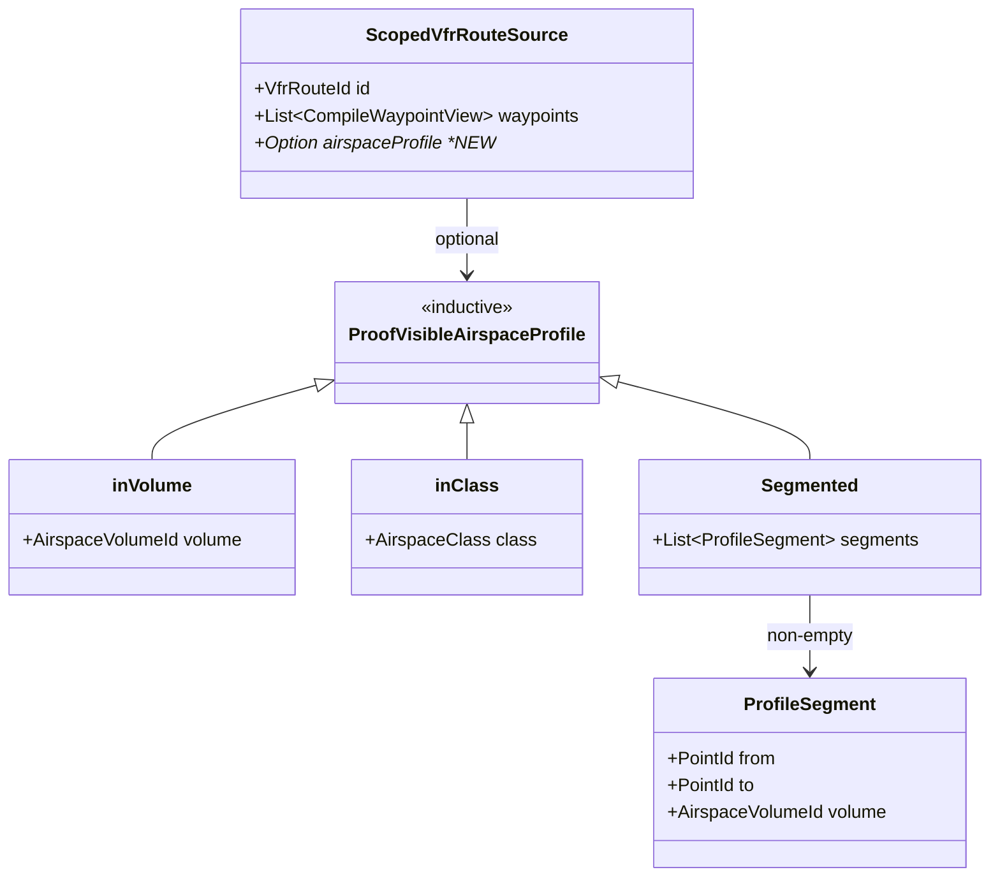

# fn-9-lift-fm-extraction-to-consume-runtime — Lift FM extraction to consume runtime VfrRoute.airspaceProfile (InVolume / InClass / Segmented)

## Overview

The Kotlin runtime models `VfrRoute.airspaceProfile` as a sealed sum with three variants (`InVolume`, `InClass`, `Segmented`) at `core/src/commonMain/kotlin/xyz/easiersaid/twr/core/world/ProcedureAndAirspaceModel.kt:67-96`, but the Lean extraction in `research/fm/lean/CertifiedAtc/RouteBearingExtraction.lean` flattens VFR routes to waypoint sequences only (`ScopedVfrRouteSource:154` carries `id` + `waypoints`). The extraction contract (`research/fm/aviation_world_extraction_contract.md:17-33`) and the parity inventory (`research/fm/parity_inventory.md:19-29`) document this gap explicitly: `airspaceProfile` "remains intentionally unextracted while the current FM branch stays closed on its narrower world model."

This epic lifts that — the airspaceProfile becomes proof-visible at the extraction layer with origin/preservation theorems. Downstream theorem strengthening (e.g. profile-aware `ClearedToEnterControlZone`) is **out of scope** for fn-9 — see `## Boundaries / non-goals`.

## Quick commands

```bash
# Single-module iteration during development
nix-shell -p lean4 --run 'cd research/fm/lean && lake build CertifiedAtc.RouteBearingExtraction'

# Full FM build (drift-control gate stack 1)
nix-shell -p lean4 --run 'cd research/fm/lean && lake build CertifiedAtc'

# Kotlin drift-control gate stack 2 + golden tests
./gradlew build
./gradlew :sim:jvmTest --tests '*LowgGoldenTest' --tests '*G2CrossAerodromeVfrTest'
```

## Boundaries / non-goals

- **Does NOT strengthen** `ClearedToEnterControlZone` / `SpecialVfrClearance` / `RemainOutsideControlledAirspace` predicates to require route/airspace profile alignment. Those `Ready`/`Issuable` predicates at `GreenfieldAirspaceWorldBackedCurrentShape.lean:43,115` stay on point-membership. Strengthening is a successor epic.
- **Does NOT widen** `worldBackedAirspaceRouteInteraction?` (`GreenfieldAirspaceWorldBackedCurrentShape.lean:27`) to consume the new profile data. Single-volume API stays as-is.
- **Does NOT bring** `AirspaceVolume.boundary` (polygonal geometry) into proof-visibility — that is the separate prospect-idea-7 branch which depends on this one.
- **Does NOT reopen** Phases 1-4 closed surfaces (`AGENT_GUIDE.md:217-237`). Conservative extension only: add alongside, never rename or restructure existing predicates.
- **Does NOT alter** the legacy/atomic bridge (`AGENT_GUIDE.md:265-275` — opt-in only, not the default extension surface).

## Strategy Alignment

Active tracks served by this plan:
- **FM / Lean proof program (`research/fm`)** — Advances the named active surface "next deliberate semantic widening branch beyond the current models — polygonal airspace, deeper route-bearing". The airspaceProfile lift makes the route's airspace structure proof-visible and is the documented prerequisite for both the polygonal-airspace and deeper-route-bearing widenings (`route_bearing_scope.md:1-26`, parity_inventory `INTENTIONALLY_OPEN` rows at `:69`).

## Decision context

- **Conservative extension over rewrite.** Lean 4 has no in-place inductive extension; renaming or restructuring `ScopedVfrRouteSource` would invalidate the closed Phase A `WORLD_BACKED_COMPLETE` claim (`parity_inventory.md:49`). We add an optional profile field alongside `waypoints`; old theorems remain literally unchanged.
- **`Option` for nullability.** `VfrRoute.airspaceProfile` is nullable (`ProcedureAndAirspaceModel.kt:91`); legacy/unannotated routes must continue to extract.
- **Sealed `inductive` mirroring runtime variants.** Three explicit constructors (`inVolume | inClass | segmented`) — no `Nonempty` shortcut. Exhaustiveness checking on `match` is the regression signal.
- **No `deriving DecidableEq` eagerly.** Avoids `Classical.propDecidable` poisoning `decide`/`native_decide` callers (Lean 4 widening pitfall).
- **No Mathlib.** Repo is pure stdlib Lean (`research/fm/lean/lakefile.lean`, `lean-toolchain v4.29.0`); helpers must be local.
- **Reuse existing extraction patterns.** Mirror the eight existing `findCompile<Family>_*` triples (`RouteBearingExtraction.lean:437,589,661`) and the well-formedness conjunct slot (`:205`). New work follows the same shape, slotted into existing files where possible.

## Acceptance

- **R1:** Lean defines a `ProofVisibleAirspaceProfile` inductive (sealed sum: `inVolume`, `inClass`, `Segmented`) mirroring the three runtime variants of `VfrRouteAirspaceProfile` at `core/.../ProcedureAndAirspaceModel.kt:77-83`, and `ScopedVfrRouteSource` (`RouteBearingExtraction.lean:154`) carries an `Option ProofVisibleAirspaceProfile` field alongside `waypoints` (existing `id` + `waypoints` unchanged).
- **R2:** `RouteBearingExtractionWellFormed` (`RouteBearingExtraction.lean:205`) gains profile-aware conjuncts capturing the runtime invariants enforced at `WorldAirspaceValidation.kt:39-141`: (a) `Segmented.segments` non-empty and each segment's `from \!= to`, (b) every referenced `AirspaceVolumeId` resolves in `airspaceVolumes`, (c) segmented endpoints align with the route's waypoint pairs (sequence-mismatch invariant). The predicate is proven for all worlds extracted by `extractRouteBearingCompileView`.
- **R3:** Origin/preservation theorems for the new profile field added in the same shape as the existing eight `findCompile<Family>_go_eq_some_of_mem` / `extractRouteBearingCompileView_<family>_origin` / `findCompile<Family>_eq_some_of_mem` triples. No existing theorem renamed; no existing Phase A or Phase 1-4 closure regressed.
- **R4:** Drift-control gate green end-to-end: `nix-shell -p lean4 --run 'cd research/fm/lean && lake build CertifiedAtc'`, `./gradlew build`, and golden tests `LowgGoldenTest` + `G2CrossAerodromeVfrTest` all green. Zero new `sorry`. No `native_decide` introduced in tracked theorems.
- **R5:** Parity / refinement inventory + extraction contract docs updated honestly to reflect the new proof-visible boundary, with what's still open (predicate strengthening, polygonal geometry, multi-volume `worldBackedAirspaceRouteInteraction?`) named explicitly. Specifically: `parity_inventory.md` runtime note + VFR-route row, `refinement_inventory.md` route-bearing row, `runtime_model_change_impact.md` `§1 VfrRoute widening` table row, `aviation_world_extraction_contract.md` status note (`:17-33`), `route_bearing_scope.md` runtime note (`:8-19`), and `PROJECT_STATUS.md` changelog entry.

## Early proof point

Task **fn-9-lift-fm-extraction-to-consume-runtime.1** validates the conservative-extension premise: it adds the profile field to `ScopedVfrRouteSource` and well-formedness without touching any closed Phase A or Phase 1-4 theorem. If `lake build CertifiedAtc` regresses an existing Phase A theorem (e.g. one of the eight `findCompile*` triples or a Phase A package theorem), the conservative-extension approach is wrong and the design must be re-evaluated before continuing — likely options: introduce a new module rather than extending in place, or split the extraction predicate into narrow + wide variants with a forgetful map.

## Requirement coverage

| Req | Description | Task(s) | Gap justification |
|-----|-------------|---------|-------------------|
| R1  | Sealed inductive + optional field on source struct | fn-9-lift-fm-extraction-to-consume-runtime.1 | — |
| R2  | Well-formedness conjuncts (segmented invariants, volume reference, sequence alignment) | fn-9-lift-fm-extraction-to-consume-runtime.1 | — |
| R3  | Origin/preservation theorems mirroring existing triples | fn-9-lift-fm-extraction-to-consume-runtime.1 | — |
| R4  | Drift-control gate green (Lean + Gradle + goldens) | fn-9-lift-fm-extraction-to-consume-runtime.1, fn-9-lift-fm-extraction-to-consume-runtime.2 | — |
| R5  | Inventory + contract + status doc updates | fn-9-lift-fm-extraction-to-consume-runtime.2 | — |

## Approach (data model after widening)



## Risk notes

- **Simp churn from new constructors.** Adding three constructors to a tracked carrier risks looping `simp` rules and hidden weakening of the closed surface. Mitigation: use `simp only [...]` with explicit lemma lists in the new proofs; do NOT add `@[simp]` to new lemmas without re-running the full `lake build CertifiedAtc`.
- **Decidable instance leak.** A `deriving DecidableEq` on the new sum can pull `Classical.propDecidable` if any field is non-decidable, silently making downstream callers `noncomputable`. Mitigation: derive nothing eagerly; add instances only where a concrete proof obligation requires them.
- **Segmented sequence-mismatch invariant** (`WorldAirspaceValidation.kt:97-141`) is a load-bearing runtime check; mirroring it as a well-formedness conjunct is small, but skipping it would leave the proof boundary weaker than the runtime — a parity inversion in the wrong direction.
- **Reopening closed Phase 1-4.** `AGENT_GUIDE.md:308-314` forbids reopening earlier phases when later ones are hard. Mitigation: every change is additive; `extractRouteBearingCompileView` mappings for existing fields are not modified.
- **Doc drift.** Changing inventory + contract docs without updating `PROJECT_STATUS.md` violates `AGENT_GUIDE.md:308-314`. Mitigation: fn-9-lift-fm-extraction-to-consume-runtime.2 bundles all six doc updates plus the changelog entry.
- **Synthetic `sorry`.** A failed tactic in a derived instance can synthesise a silent sorry. Mitigation: grep for `sorry` in the new files before merging; treat compile warnings as errors.

## Test notes

There is no Lean test harness — `lake build` IS the test for FM work (`research/fm/AGENT_GUIDE.md:259-263`). The Kotlin drift-control gate runs in parallel: `./gradlew build` plus the two golden tests must remain green. No new Kotlin tests are required for fn-9 because the runtime side is already covered by `WorldConstructionTest.kt:213-235,575-881` (validates all three profile variants) and `LowgGoldenTest` / `G2CrossAerodromeVfrTest`.

For task fn-9-lift-fm-extraction-to-consume-runtime.1, "test" means: every existing theorem in `CertifiedAtc.RouteBearingExtraction` and downstream importers (`RouteBearingResolutionBridge`, `GreenfieldRouteBearingCurrentShape*`, `GreenfieldDeliveredRefinement`) still compiles, and the new well-formedness conjuncts and origin/preservation theorems compile without `sorry`.

## Open questions

1. **Compile-view extension.** Does `CompileVfrRouteView` (`ClearanceEnvelope.lean:343-346`) also need an optional profile field, or does the profile ride only on `ScopedVfrRouteSource` (the source struct) without flowing into the compile-view? Default: extend the source only; flip if a downstream proof needs it.
2. **`InClass`-only profiles** (no volume id). Runtime treats class-A/B/C/D `InClass` profiles without an associated volume as a controlled-without-volume validation issue (`WorldAirspaceValidation.kt:97-141`). Should the FM extraction (a) filter these out at extract-time and document, or (b) carry them in with a `Prop` guard? Default: filter out; revisit if the polygonal-airspace successor needs them.
3. **Sequence-alignment shape.** Capture segmented `from`/`to` alignment with waypoint pairs as (a) a conjunct in `RouteBearingExtractionWellFormed` (smaller proof, weaker statement: only extracted worlds are well-formed) or (b) a derived theorem on the source struct itself (stronger but bigger). Default: (a) conjunct; matches existing predicate-stack pattern.

## References

- Source: `.flow/prospects/lean-fm-next-steps-2026-05-08.md#idea-3` (size M, persona senior-maintainer)
- Pre-existing impact analysis: `research/fm/runtime_model_change_impact.md` §1 lines 83-131 (classifies this widening as Class C — proof-visible theorem-surface change)
- Active surface narrative: `research/fm/route_bearing_scope.md:1-26`, `research/fm/parity_inventory.md:69` (intentionally-open branches)
- Frozen-phase rules: `AGENTS.md:174-178`, `research/fm/AGENT_GUIDE.md:217-237,265-275,308-314`
- Drift-control gate spec: `research/fm/refinement_inventory.md:43-54`
- Runtime ADT: `core/src/commonMain/kotlin/xyz/easiersaid/twr/core/world/ProcedureAndAirspaceModel.kt:67-96` (sealed interface), `:414-427` (AirspaceVolume), `:91` (nullable on VfrRoute)
- Runtime invariants to mirror: `core/src/commonMain/kotlin/xyz/easiersaid/twr/core/world/WorldAirspaceValidation.kt:39-141`
- Lean extraction site: `research/fm/lean/CertifiedAtc/RouteBearingExtraction.lean:154,181,193,205,437,589,661,799`
- Lean compile-view: `research/fm/lean/CertifiedAtc/ClearanceEnvelope.lean:343-346`
- Reusable airspace-route seam: `research/fm/lean/CertifiedAtc/GreenfieldAirspaceWorldBackedCurrentShape.lean:27-41`
- Strategy: `STRATEGY.md` "FM / Lean proof program" track (active surface section)
- Lean 4 widening pitfalls: [`nielsvoss/lean-pitfalls`](https://github.com/nielsvoss/lean-pitfalls), [Mathlib naming](https://leanprover-community.github.io/contribute/naming.html)
